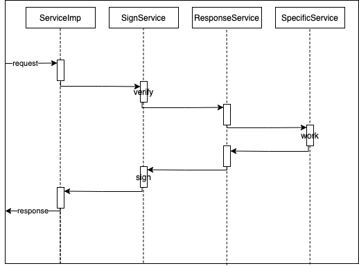

# FileStoragePlugin Documentation

## Base Conception

**Netmap** stores information of  all online storage nodes  in NeoFS network. It's managed by [NetmapContract](https://github.com/nspcc-dev/neofs-contract/blob/master/netmap/netmap_contract.go). The most often use methods are `GetNetmapByEpoch`and `GetNetmapByDiff`. Besides, this contract alsos manage epoch updating. Note: only InnerRing nodes can change state of this contract.

**Container** is created by users and stored in [ContainerContract](https://github.com/nspcc-dev/neofs-contract/blob/master/container/container_contract.go). All operations toward container are contract invocations. The same as netmap, only InnerRing nodes can change contract state. Users can only poposal container operations like `Put` `Delete`by invoking this contract. Container has `PlacementPolicy` which indicate which nodes in `Netmap` should store objects in this container. Also container has ACL(Access Control Lists) to control users permission.

**Object** is stored in container logically. But objects are stored off-chain on storage node disks in practice. You can't get any information of object on chain. Object has two main parts `Header` and `Payload`. `Header` has all meta information of the object while `Payload` is the data of file users want to store in NeoFS netowrk.

## Storage

[LocalObjectStorage](./localobjectstorage.md) This is where objects are stored.

## Services

#### gRPC Services

All gRPC services have 4 layer.

**First** layer is implementation of server side service defined in .proto file in [neofs-api](https://github.com/nspcc-dev/neofs-api). And this part also catch request handling exception and return a `GRpcException`.

* *AccountingServiceImp* Server side implementation of [Accounting Service](https://github.com/neo-ngd/neofs-api-csharp/blob/a8f39202ca1893e50303aa636ec2162544f4ff22/src/Neo.FileStorage.API/accounting/service.proto#L17-L20)
* *ContainerServiceImp* Server side implementation of [Container Service](https://github.com/neo-ngd/neofs-api-csharp/blob/a8f39202ca1893e50303aa636ec2162544f4ff22/src/Neo.FileStorage.API/container/service.proto#L17-L47)
* *ObjectSerivceImp*  Server side implementation of [Object Service](https://github.com/neo-ngd/neofs-api-csharp/blob/a8f39202ca1893e50303aa636ec2162544f4ff22/src/Neo.FileStorage.API/object/service.proto#L14-L56)
* *NetmapServiceImp* Server side implementation of [NetmapService](https://github.com/neo-ngd/neofs-api-csharp/blob/a8f39202ca1893e50303aa636ec2162544f4ff22/src/Neo.FileStorage.API/netmap/service.proto#L16-L26)
* *SessionServiceImp* Server side implementation of [SessionService](https://github.com/neo-ngd/neofs-api-csharp/blob/a8f39202ca1893e50303aa636ec2162544f4ff22/src/Neo.FileStorage.API/session/service.proto#L15-L18)
* *ControlServiceImp* Server side implementation of [ControlService](https://github.com/neo-ngd/neo-plugins/blob/49eb7b9f1933c8b1a61b57d8613402c2006edb5d/src/FileStorageST/services/Control/Service/service.proto#L11-L23)

**Second** is specific implementation of [SignService](../Services/SignService.cs) which is to verify request signatures and sign responses.

**Third** is specific implementation of [ResponseService](../Services/ResponseService.cs) which is to decorate response with common [MetaHeader](https://github.com/neo-ngd/neofs-api-csharp/blob/a8f39202ca1893e50303aa636ec2162544f4ff22/src/Neo.FileStorage.API/session/types.proto#L148-L169)

**Forth** is specific service to do the work. These services are following:

* [AccountingService](./services/accounting.md) Get balance of owner in NeoFS network.
* [ContainerService](./services/container.md) Operations on container.
* [ObjectSerivce](./services/object.md) Operations on object.
* [NetmapService](./services/netmap.md) Epoch and node information.
* [SessionService](./services/session.md) To create session.
* [ControlService](./services/control.md) API for administrators.

#### Other Services

* [PoliceService](./services/police.md) Find objects to replicate
* [ReplicateService](./services/replicate.md) Replicate objects
