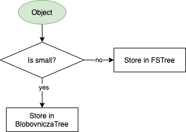
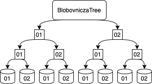

# LocalObjectStorage

`StorageEngine` is comprised by [shards](#Shard).

## Shard

If *UseWriteCache* is enabled, shard will use [WriteCache](#WriteCache) to store object first.

* GC

   Shard will remove expired objects when epoch is updated.

### WriteCache

WriteCahce use a database(*leveldb* here) and memory to store object for temporary.

* persist
In every *DefaultInterval*, WriteCache will persist objects from memory to files or database.

* flush
In every  *DefaultInterval*, WriteCache will flush objects to [BlobStore](#Blob) and [Metabase](#Metabase).

### Metabase

A database that meta data of objects are stored in.

|Table|Prefix|Key|Data|Description|
|-|-|-|-|-|
|ContainerSize|0x00|ContainerID|ulong|Container size.|
|Primary|0x01|Address|ObjectHeader|Regular Object header.|
|GraveYard|0x02|Address|Tombstone ObjectID|To mark deleted object.|
|Tombstone|0x03|Address|ObjectHeader|Tombstone object header.|
|StorageGroup|0x04|Address|ObjectHeader|StorageGroup object header.|
|Root|0x05|Address|SplitInfo|SplitInfo of child object. See [SplitObject.](./services/ObjectService.md)|
|Parent|0x06|Address|ObjectID list|Linkobject ObjectId and LastObject ObjectId. See [SplitObject.](./services/ObjectService.md)|
|Small|0x07|Address|BlobovniczaID|Get small object from BlobStorage using BlobovniczaID.|
|ToMoveIt|0x08|Address|0xff|Mark object as movable.|
|PayloadHash|0x09|ContainerID+PayloadHash|ObjectID list|Objects with same payload hash.|
|Split|0x0a|ContainerID+SplitID|ObjectID list|Objects with the same split id.|
|Owner|0x0b|Address+OwnerID|0xff|Mark objects with owner in container|
|Attribute|0x0c|Address+AttributeKey+ AttributeValue|0xff|Mark object and attribute|

### BoboStorage

Small objects are stored in Blobovnicza. Big objects are stored in files.



#### BlobovniczaTree



> A 2*3 blobovnicza tree.

Elements of the deepest level are blobovniczas and the levels above are folders.

Blobovniczas are allocated dynamically. At each moment of the time there is an active blobovnicza, set of already filled blobovniczas and list of not yet initialized blobovniczas. After filling the active blobovnicza it becomes full, and next blobovnicza becomes initialized and active.

Active blobovniczas and some of the full blobovniczass are cached (LRU). All cached blobovniczas are intitialized and opened.

Object is saved as follows:

1. At each level, the folders are sorted by object address, and dives into the next one until we reach the deepest.
2. We try saving object into the active blobovnicza. If it's full, the next blobovnicza is opened, initialized and cached. If there is no  more available blobovnicza, go to step 1. and process in the deepest level in the next folder.

##### Blobovnicza

A wrapper of database(*leveldb*)  to store object. We limit its maximum size. So that if the blobovnicza is full. Object can't be stored into it anymore.

#### FSTree

Store object into a file. We split object address string as path. The folder depth can be configured by users. As default we use every two charactor of address tring as folder. For example:

```
address: MLFfaXvfRNdJuCBBym4aTWuUMpBVaoEsbupgeZxbLNF/C3dicb6rCdmsZF6remRptWhMgfymdCjF4XAvPFk8XoFA
path: ML/Ff/aX/vf/RN/dJ/uC/BB/ym/4a/TW/uU/Mp/BV/ao/Es/bu/pg/eZ/xb/LN/F./C3/di/cb/6r/Cd/ms/ZF/6r/em/Rp/tW/hM/gf/ym/dC/jF/4X/Av/PF/k8/Xo/FA/MLFfaXvfRNdJuCBBym4aTWuUMpBVaoEsbupgeZxbLNF.C3dicb6rCdmsZF6remRptWhMgfymdCjF4XAvPFk8XoFA

```
> We repace '/' with '.'  in address string first.
