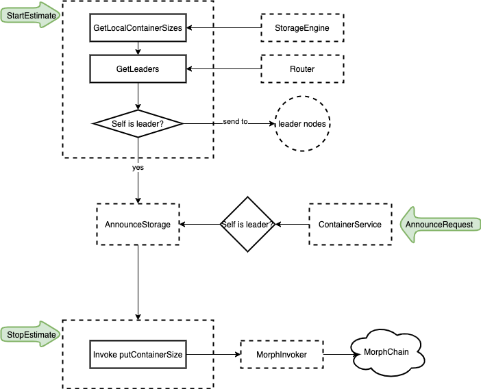

# Container Service

#### Delete

Invoke [delete](https://github.com/nspcc-dev/neofs-contract/blob/63673a5e54f5716e47ede8d51969c17dccac51c1/container/container_contract.go#L304) of `ContainerContract` and send the transaction.

#### Get

Locally invoke [get](https://github.com/nspcc-dev/neofs-contract/blob/63673a5e54f5716e47ede8d51969c17dccac51c1/container/container_contract.go#L359) in `ContainerContract` and return the [container](https://github.com/neo-ngd/neofs-api-csharp/blob/7cc8b3a533623ae4777fabdd19f51b255987916d/src/Neo.FileStorage.API/container/types.proto#L15-L62) with signature.

#### GetExtendedACL

Locally invoke [eACL](https://github.com/nspcc-dev/neofs-contract/blob/63673a5e54f5716e47ede8d51969c17dccac51c1/container/container_contract.go#L467) in `ContainerContract` and return [EACLTable](https://github.com/neo-ngd/neofs-api-csharp/blob/7cc8b3a533623ae4777fabdd19f51b255987916d/src/Neo.FileStorage.API/acl/types.proto#L163-L173) with signature.

#### List

Locally invoke [list](https://github.com/nspcc-dev/neofs-contract/blob/63673a5e54f5716e47ede8d51969c17dccac51c1/container/container_contract.go#L381) in `ContainerContract`. And return a [ContainerID](https://github.com/neo-ngd/neofs-api-csharp/blob/7cc8b3a533623ae4777fabdd19f51b255987916d/src/Neo.FileStorage.API/refs/types.proto#L55-L58) list of user specified [OwnerId](https://github.com/neo-ngd/neofs-api-csharp/blob/7cc8b3a533623ae4777fabdd19f51b255987916d/src/Neo.FileStorage.API/refs/types.proto#L75-L78).

#### Put

Invoke [put](https://github.com/nspcc-dev/neofs-contract/blob/63673a5e54f5716e47ede8d51969c17dccac51c1/container/container_contract.go#L156) in `ContainerContract` and send the transaction. When the transaction is persisted, InnerRing nodes will get the container put notification. They will vote for container put if the container and signature verified successfully.

### SetExtendedACL

Invoke [setEACL](https://github.com/nspcc-dev/neofs-contract/blob/63673a5e54f5716e47ede8d51969c17dccac51c1/container/container_contract.go#L410) in `ContainerContract`  and send the transaction. When the transaction is persisted, InnerRing nodes will get the EACL put notification. They will vote for EACL put if the [EACLTable](https://github.com/neo-ngd/neofs-api-csharp/blob/7cc8b3a533623ae4777fabdd19f51b255987916d/src/Neo.FileStorage.API/acl/types.proto#L163-L173) and signature verified successfully.

#### AnnounceUsedSpace

Other storage node will send their used space sizes of every container. See [UsedSpaceService](#UsedSpaceService)

### UsedSpaceService

This service is used to collect container used space from local disk and other nodes.
The collection is triggered by new `epoch`. At last, leader nodes of a container will invoke [putContainerSize](https://github.com/nspcc-dev/neofs-contract/blob/63673a5e54f5716e47ede8d51969c17dccac51c1/container/container_contract.go#L483) to put container used space size on chain. InnerRing use these data to charge container owner stroage fee and reword storage nodes.

#### Controller

When `StartEstimate` event received, contoller will start announce

* Get all container used space sizes from *StorageEngine*
* Send local container size to leader nodes that are chosen from [Router](#Router)

When `StopEstimate` event received, contoller will report the container used spaces if it's leader node.

> `StartEstimate` and `StopEstimate` are contract notifications from `ContainerContract`controlled by InnerRing

#### Router

Choose the first nodes in every group of container nodes as leader nodes.

#### Storage

Store container used space sizes of every container in specific epoch.

