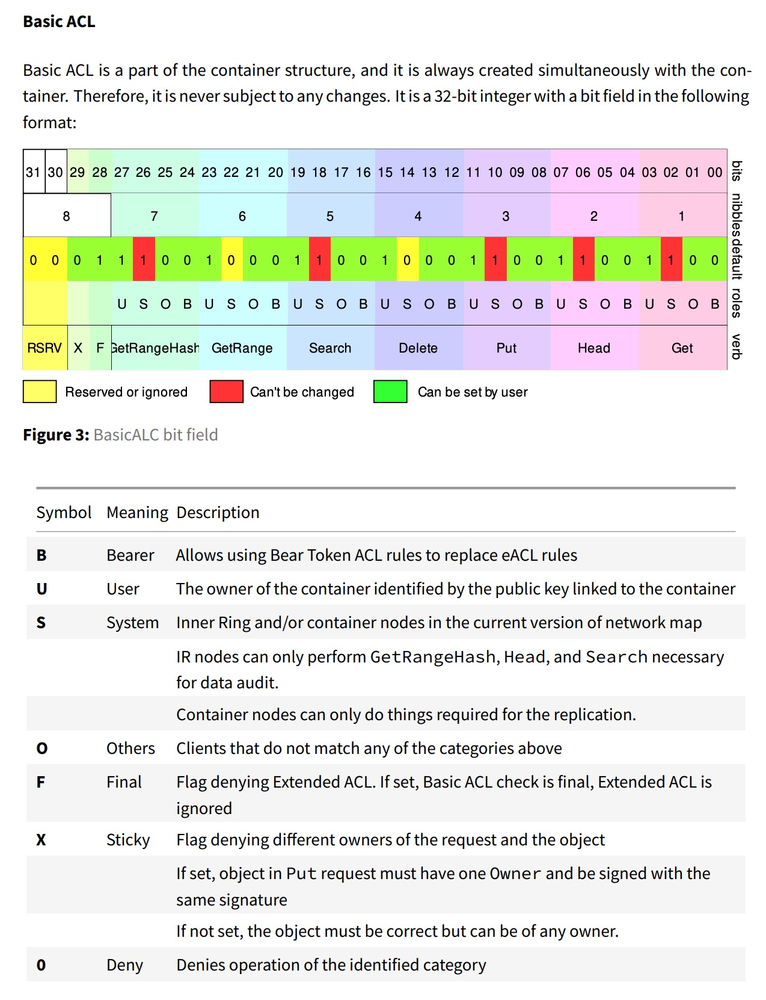
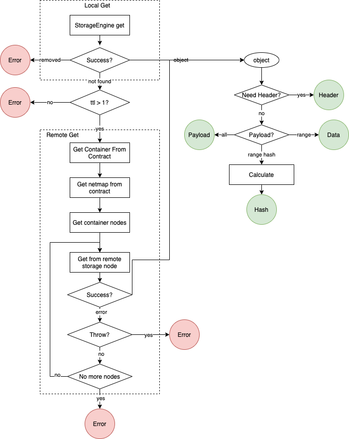
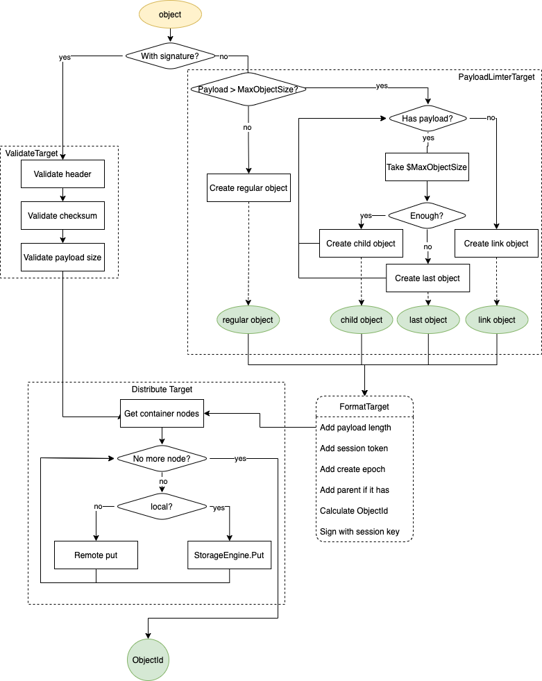

# ObjectService

## Base Conception

* **SplitObject** refer to [NeoFS Spec.ArchitectureOverview.Objects.LargeObjectsSplit](https://nspcc.ru/upload/neofs-spec-latest.pdf)

* **ACL** refer to [NeoFS Spec.ArchitectureOverview.AccessControlLists](https://nspcc.ru/upload/neofs-spec-latest.pdf)

  * BasicACL

    

## GetService

This service serves multiple request including `Get` `GetHeader` `GetRange` `GetRangeHash`

1. Try local object storage. Return if find the object .
2. Try every node in container until find the object. Return if find the object.
3. Throw object not found.

> If user sets ttl less than 2, GetService only executes local get.

## PutService

PutService will have different  behaviors according to whether a object has signature.

If a object with signature, it's expected to be filled with all required parameters including checksum, payload length...

If a object doesn't have signature, PutService will automatically  fill necessary fields and sign object with session key.

## DeleteService

When received object delete request, storage node assemble a tombestone object and broadcast it.

Storage nodes will remove target object when receive the tombstone object.

Tombstone object has epoch expiration attribute which is usually 5 epochs. So it will be automatically removed by GC in local object storage.

## SearchService

SearchService executes like GetService.

1. Local search via *StorageEngine.Search*
2. If ttl > 1, request remote object search to all container nodes.
