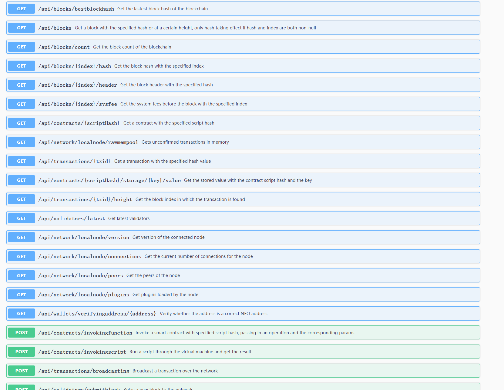
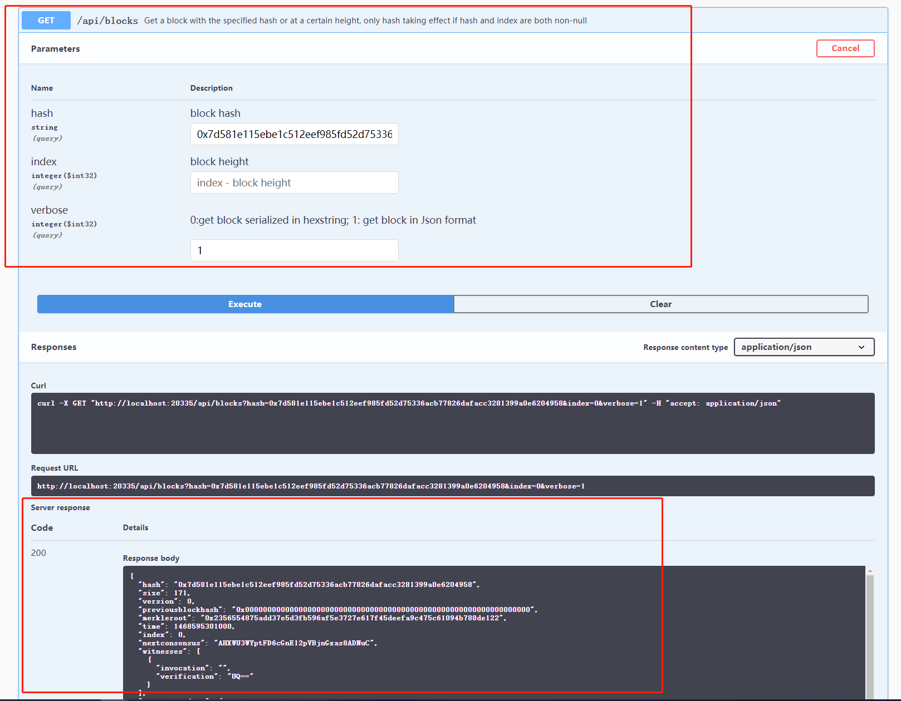
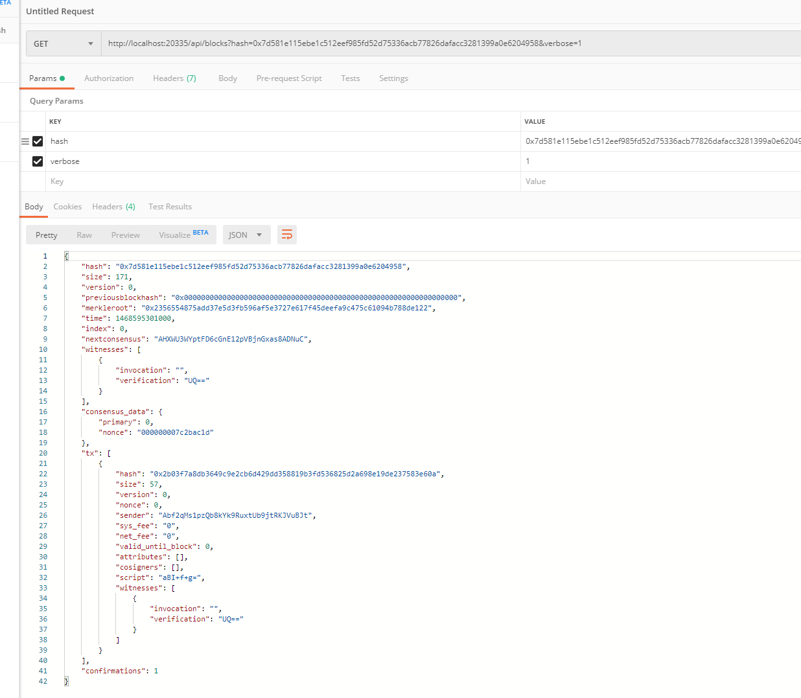

# Restful Guidelines
## Enabling Services

Each neo-cli can optionally install Restful plugin to enable related services. You can type the following command to install the resuful plugin:

`install RestPlugin`

After installation, you need to restart the neo-cli server for the plugin to take effect.

## Modifying configuration file
Before installing the plugin, you can modify the BindAddress, Port and other parameters in the config.json file in the GraphQL folder:

```
    {
    "PluginConfiguration": {
        "BindAddress": "127.0.0.1",
        "Port": 20335,
        "SslCert": "",
        "SslCertPassword": "",
        "MaxGasInvoke": 10
        }
    }
```

## Interface List
 
| Type| URL | Param | Desc | 
|---|-------|-----|----|
|GET|api/contracts/{scriptHash}/storage/{key}/value| scriptHash & key| Get the stored value with the contract script hash and the key|
|GET|api/blocks/bestblockhash | - | Gets the hash of the tallest block in the main chain|
|GET|api/blocks|index & hash & [verbose=0]| Get a block at a certain height or with the specified hash, only hash taking effect if hash and index are both non-null|
|GET|api/blocks/count|-| Get the block count of the blockchain|
|GET|api/blocks/{index}/hash|index| Get the block hash with the specified index|
|GET|api/blocks/{index}/header|index & [verbose=0]| Get the block header with the specified hash|
|GET|api/blocks/{index}/sysfee|index|Get the system fees before the block with the specified index|
|GET|api/network/localnode/rawmempool|[getUnverified=0]|Gets unconfirmed transactions in memory|
|GET|api/transactions/{txid}|txid & [verbose=0]|  Get a transaction with the specified hash|
|GET|api/transactions/{txid}/height|txid| Get the block index in which the transaction is found|
|GET|api/contracts/{scriptHash}|scriptHash|Get a contract with the specified script hash|
|GET|api/validators/latest|-|Get latest validators|
|GET|api/network/localnode/peers|-| Get the peers of the node |
|GET|api/network/localnode/version|-| Get version of the connected node|
|GET|api/network/localnode/connections|-| Get the current number of connections for the node|
|GET|api/network/localnode/plugins|-| Get plugins loaded by the node|
|GET|api/wallets/verifyingaddress/{address}|address| Verify whether the address is a correct NEO address|
|POST|api/contracts/invokingscript|script & [hashes]| Run a script through the virtual machine and get the result|
|POST|api/contracts/invokingfunction|scriptHash & operation & [params]|  Invoke a smart contract with specified script hash, passing in an operation and the corresponding params	|
|POST|api/transactions/broadcasting | hex | 	Broadcast a transaction over the network |
|POST|api/validators/submitblock | hex | Relay a new block to the network, required to be a consensus node |

Note：`[]` means the parameter is optional.

## Test Tools
In addition to the general ways, such as browser, postman, etc., to type the corresponding URL to obtain the corresponding rest service, you can also use Swagger to access the corresponding interface more easily. Swagger is a restful-oriented document automatic generation and functional testing software. You can enter http://somewebsite.com:port/index.html in the browser to access the online debugging tool provided by Swagger. The UI screenshot is as follows:



Then select the required interface, input the required parameters, and click execute to obtain the query results.

## Query Example

Here we take the Swagger UI as an example to obtain the block with the specified block index, as follows:


Alternatively, you can use Postman to query the interface, as follows:


